# AWS Automatic Payroll Processing & Payslip Delivery Engine

An **enterprise-grade, event-driven AWS serverless automated payroll engine** built to process monthly employee compensation, calculate taxes/deductions, dynamically render official PDF payslips, securely store records in Amazon S3, and deliver transactional notifications via Amazon SES with pre-signed download access.

Developed for **Nikita Logistics Pvt. Ltd.** under the **F13 Technologies Internship Program**.

---

## Table of Contents

- [Architecture Overview](#architecture-overview)
- [Key Features](#key-features)
- [System Processing Workflow](#system-processing-workflow)
- [AWS Infrastructure Breakdown](#aws-infrastructure-breakdown)
  - [1. Event Ingestion & Queueing (API Gateway + SQS)](#1-event-ingestion--queueing-api-gateway--sqs)
  - [2. Serverless Payroll Worker (AWS Lambda + ReportLab Layer)](#2-serverless-payroll-worker-aws-lambda--reportlab-layer)
  - [3. Database Design (Amazon DynamoDB)](#3-database-design-amazon-dynamodb)
  - [4. Storage & Payslip Delivery (Amazon S3 + Amazon SES)](#4-storage--payslip-delivery-amazon-s3--amazon-ses)
  - [5. HR Administration Portal (S3 Static Hosting)](#5-hr-administration-portal-s3-static-hosting)
- [Payroll Calculation Logic](#payroll-calculation-logic)
- [Security, IAM & Observability](#security-iam--observability)
- [Cost Model & Financial Analysis](#cost-model--financial-analysis)
- [Project Assets & Documentation Catalog](#project-assets--documentation-catalog)
- [Team & Acknowledgments](#team--acknowledgments)

---

## Architecture Overview

The system employs a **decoupled, asynchronous, event-driven microservice architecture** designed for zero-idle cost, high throughput, fault tolerance, and strict data isolation.

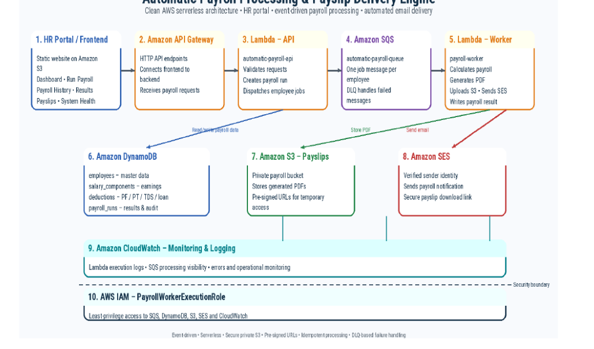

### Key Architectural Highlights:
* **Asynchronous Queue-Driven Ingestion**: Offloads payroll generation requests to Amazon SQS, eliminating HTTP gateway timeouts and buffer overflow under surge workloads.
* **Fault Isolation via Dead-Letter Queue (DLQ)**: Failed records are isolated in `automatic-payroll-dlq` after 3 retry attempts without blocking main queue operations.
* **DynamoDB On-Demand Billing**: Zero provisioned capacity overhead; automatic scaling for read/write spikes.
* **Secure Short-Lived Payslip Access**: Generated PDFs remain strictly private in Amazon S3. Employee emails contain temporary, time-bound S3 pre-signed URLs.

---

## Key Features

- **Automated Net Pay Computation**: Dynamically calculates Gross Salary, HRA, Allowances, PF, Loan Deductions, and Tax Deducted at Source (TDS).
- **Dynamic Vector PDF Rendering**: Uses a dedicated AWS Lambda Layer packaged with `ReportLab` to produce clean, high-resolution PDF payslips.
- **Automated Transactional Emails**: Delivers HTML payslip notifications directly to employee inboxes via Amazon SES.
- **Dead-Letter Queue (DLQ) Monitoring**: Built-in DLQ mechanism to capture, inspect, and reprocess unhandled execution anomalies.
- **Responsive HR Administration Portal**: Static web dashboard hosted on Amazon S3 for initiating payroll runs, tracking system health, and viewing historical employee ledgers.
- **Comprehensive Operational Observability**: Full execution log aggregation and tracing via Amazon CloudWatch.

---

## System Processing Workflow

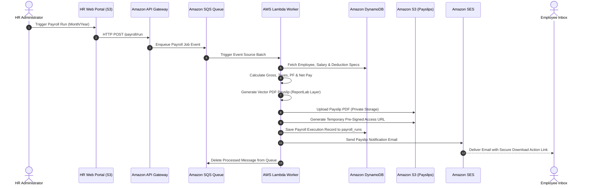

---

## AWS Infrastructure Breakdown

### 1. Event Ingestion & Queueing (API Gateway + SQS)
* **Amazon SQS Queue (`automatic-payroll-queue`)**: Standard queue acting as the primary buffer between the web frontend and worker services.
* **Dead-Letter Queue (`automatic-payroll-dlq`)**: Configured with a `maxReceiveCount` of 3 to catch and inspect poisoned or corrupt messages.

| SQS Queue Name | Visibility Timeout | Message Retention | DLQ Target |
| :--- | :--- | :--- | :--- |
| `automatic-payroll-queue` | 30 Seconds | 4 Days | `automatic-payroll-dlq` |
| `automatic-payroll-dlq` | 30 Seconds | 14 Days | N/A |

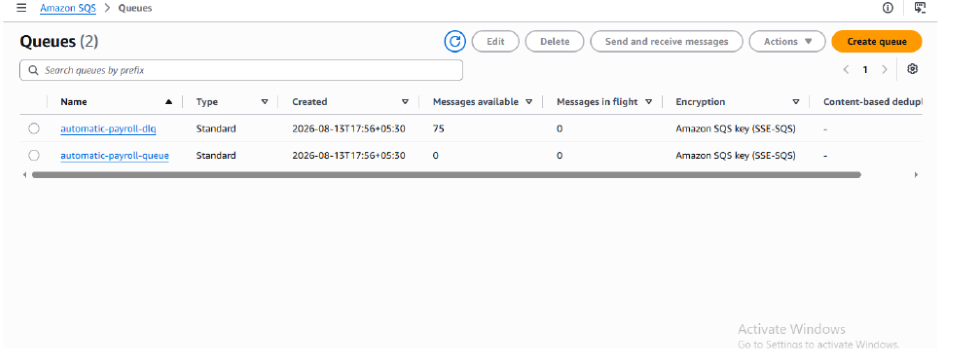
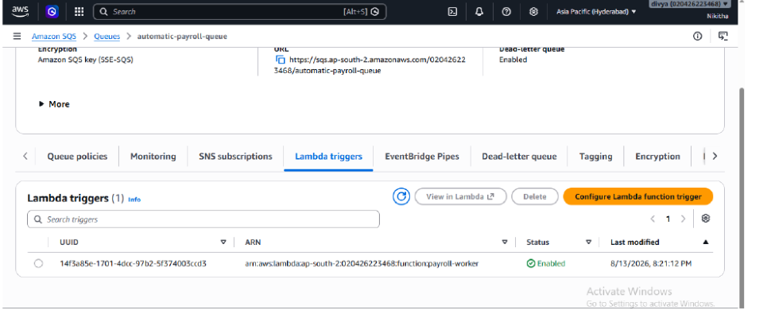

---

### 2. Serverless Payroll Worker (AWS Lambda + ReportLab Layer)
* **Function (`payroll-worker`)**: Core execution module running on **Python 3.14** with 512 MB memory allocation.
* **Layer (`payroll-reportlab-layer`)**: Attached Lambda layer containing compiled binaries of `ReportLab` for PDF creation.

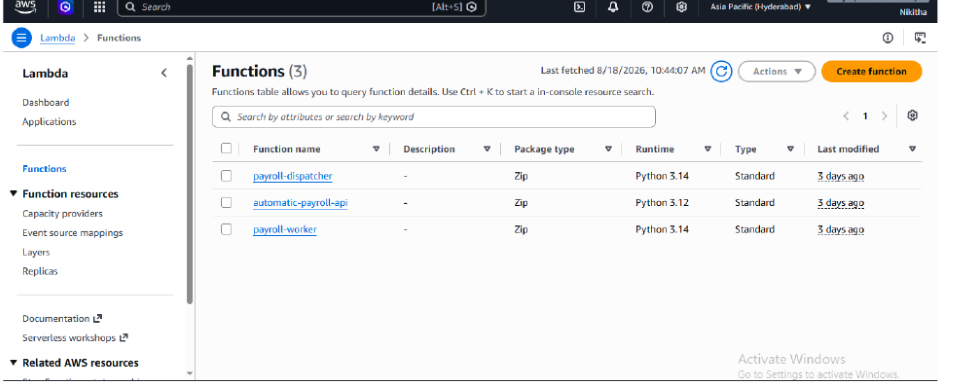
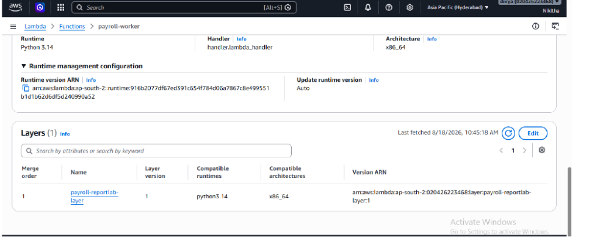
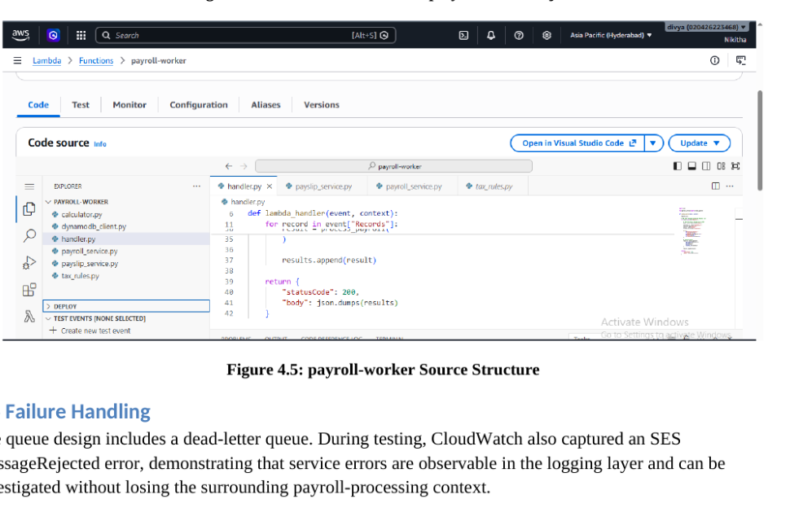
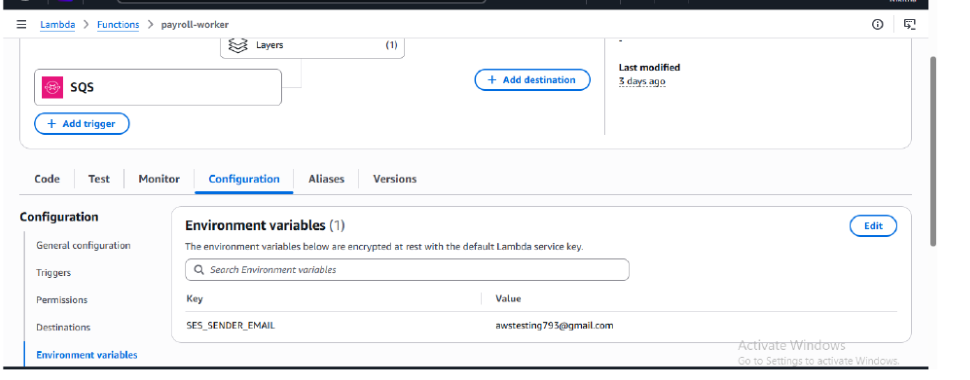

---

### 3. Database Design (Amazon DynamoDB)

The system relies on four relational-concept DynamoDB tables operating on On-Demand capacity mode.

| Table Name | Primary Key (Partition Key) | Description / Contents |
| :--- | :--- | :--- |
| `employees` | `employee_id` (String) | Master employee details (Name, Designation, Email, DOJ, Department). |
| `salary_components` | `employee_id` (String) | Compensation breakdown (Base Pay, HRA, Transport Allowance, Other Allowances). |
| `deductions` | `employee_id` (String) | Deduction parameters (Loan Deduction, PF %, TDS Tax %). |
| `payroll_runs` | `payroll_id` (String) | Historical execution ledger storing gross pay, net pay, run status, timestamp, and PDF S3 path. |

#### DynamoDB Console Evidence:
| Employees Table | Salary Components Table |
| :---: | :---: |
| 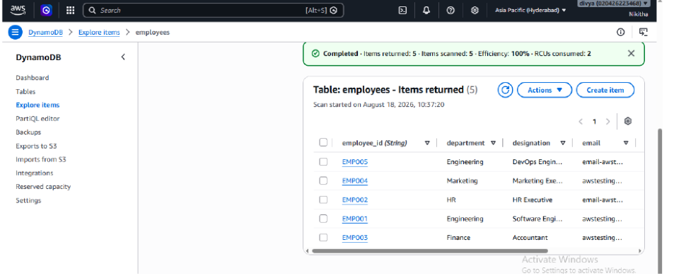 | 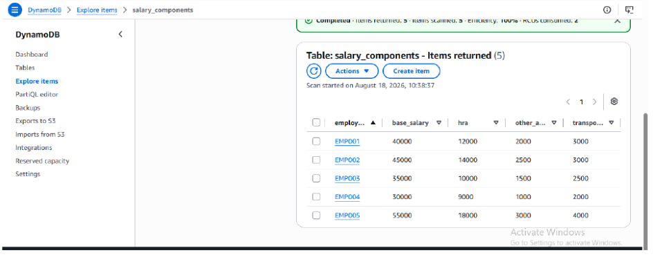 |

| Deductions Table | Payroll Runs Table |
| :---: | :---: |
| 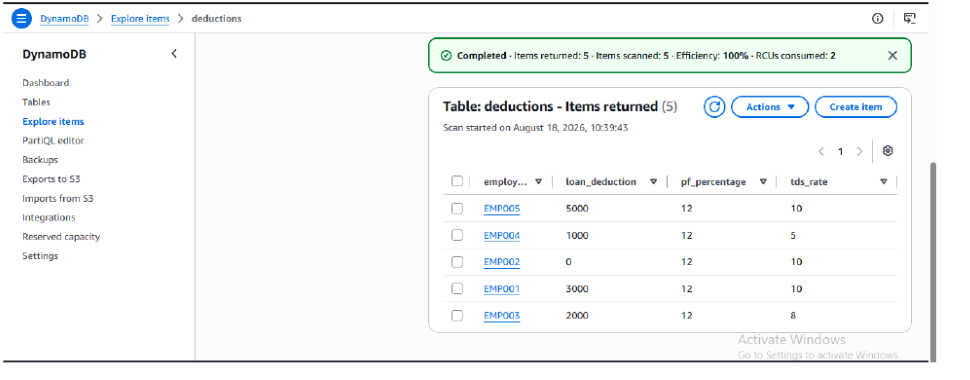 | 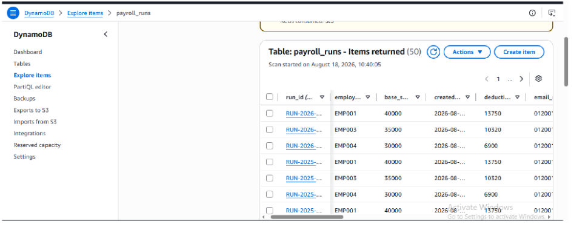 |

---

### 4. Storage & Payslip Delivery (Amazon S3 + Amazon SES)

* **S3 Bucket (`automatic-payroll-payslips-2026`)**: Private storage bucket structured by run date: `payslips/{year}/{month}/RUN-{id}/{employee_id}.pdf`.
* **Amazon SES**: Delivers styled HTML email notifications to employees featuring personalized pay figures and a one-click secure download button.

| S3 Storage Object | SES Email Notification | Generated PDF Payslip |
| :---: | :---: | :---: |
| 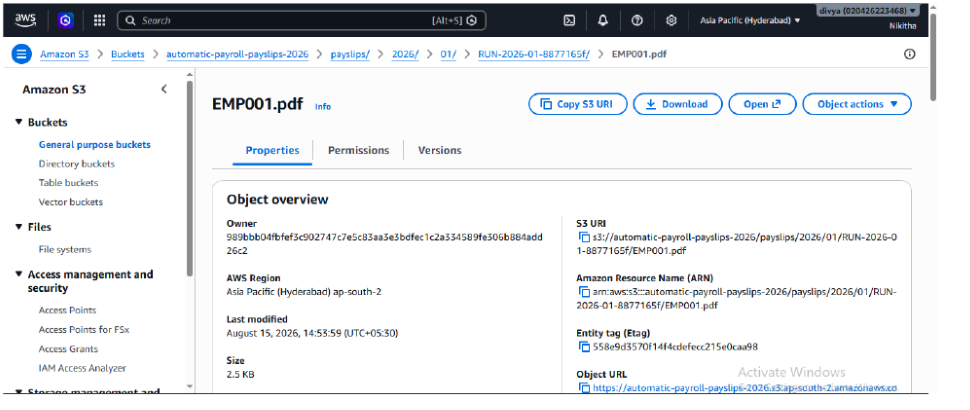 | 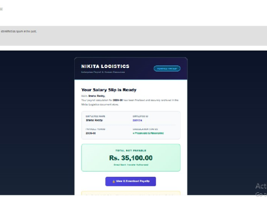 | 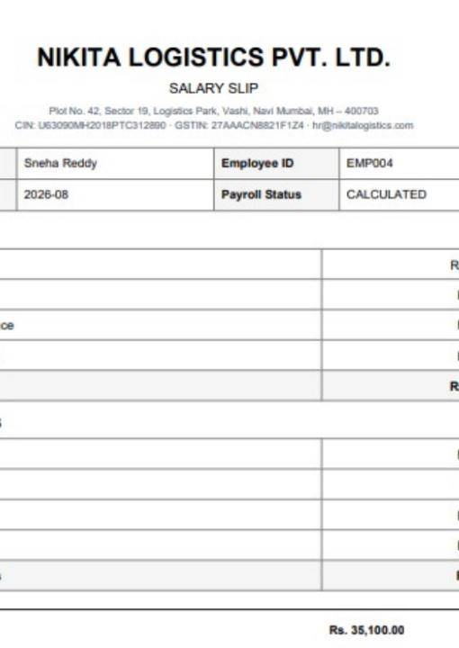 |

---

### 5. HR Administration Portal (S3 Static Hosting)

The front-end operational dashboard is hosted on an S3 bucket configured for static web hosting (`nikita-logistics-payroll-frontend-2026.s3-website.ap-south-2.amazonaws.com`).

#### HR Portal Interface Views:
| HR Dashboard Overview | System Health & Async Workers |
| :---: | :---: |
| 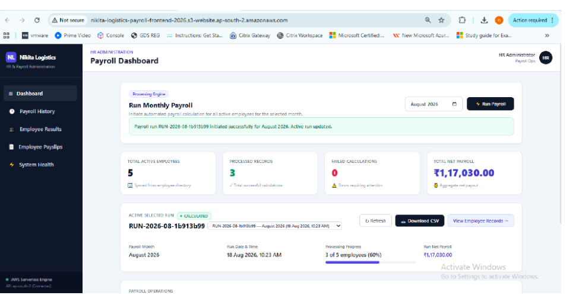 | 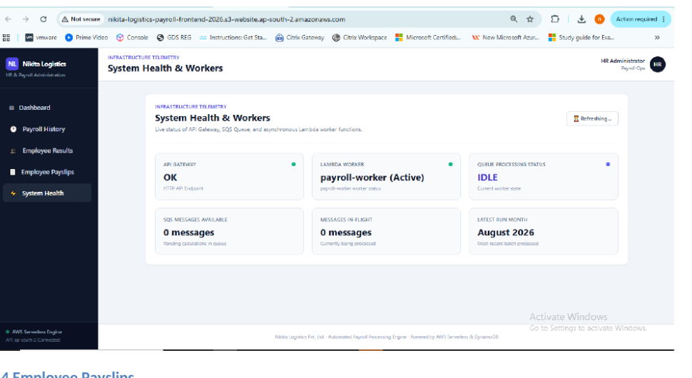 |

| Employee Payslips Search & Ledger | Payroll Execution Breakdown |
| :---: | :---: |
| 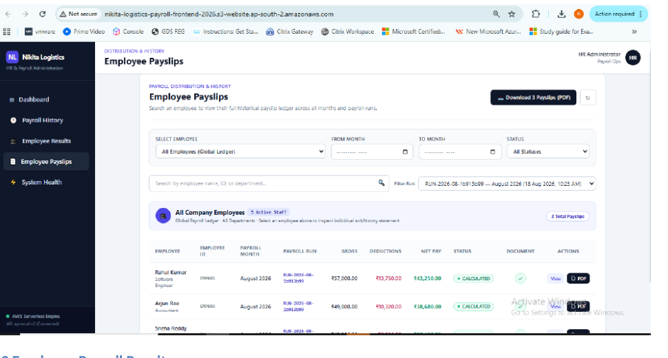 |  |

---

## Payroll Calculation Logic

The mathematical engine applies the following formula for every active employee:

$$\text{Gross Salary} = \text{Base Salary} + \text{HRA} + \text{Transport Allowance} + \text{Other Allowances}$$

$$\text{PF Deduction} = \text{Base Salary} \times \left( \frac{\text{PF Percentage}}{100} \right)$$

$$\text{TDS Tax} = \text{Gross Salary} \times \left( \frac{\text{TDS Percentage}}{100} \right)$$

$$\text{Total Deductions} = \text{Loan Deduction} + \text{PF Deduction} + \text{TDS Tax}$$

$$\text{Net Pay} = \text{Gross Salary} - \text{Total Deductions}$$

### Sample Verified Computation (`EMP004` - August 2026):
- **Base Salary**: ₹25,000.00
- **HRA**: ₹10,000.00 | **Transport Allowance**: ₹2,000.00 | **Other Allowances**: ₹8,000.00
- **Gross Salary**: **₹45,000.00**
- **PF (12% of Base)**: ₹3,000.00 | **TDS (10% of Gross)**: ₹4,500.00 | **Loan**: ₹2,400.00
- **Total Deductions**: **₹9,900.00**
- **Net Pay Delivered**: **₹35,100.00**

---

## Security, IAM & Observability

### 1. IAM Execution Role (`PayrollWorkerExecutionRole`)
Configured following the **Principle of Least Privilege**:
* `AWSLambdaBasicExecutionRole` (CloudWatch log stream creation and write)
* `AWSLambdaSQSQueueExecutionRole` (SQS polling, message deletion, visibility timeouts)
* Custom S3 Policy: `s3:PutObject` & `s3:GetObject` on `arn:aws:s3:::automatic-payroll-payslips-2026/*`
* Custom DynamoDB Policy: `dynamodb:GetItem`, `dynamodb:Query`, `dynamodb:Scan`, `dynamodb:PutItem`
* Custom SES Policy: `ses:SendEmail`, `ses:SendRawEmail`

### 2. Operational Monitoring (Amazon CloudWatch)
Logs are ingested in real-time under `/aws/lambda/payroll-worker`, capturing event parsing, calculation metrics, S3 bucket keys, and email delivery receipts.

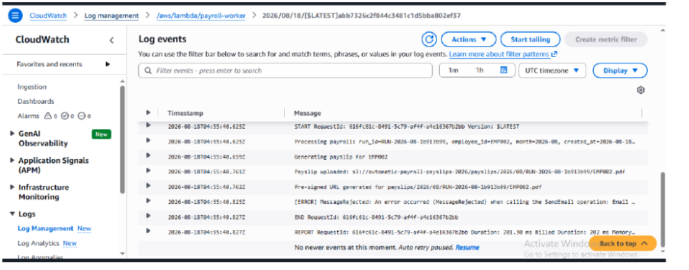

---

## Cost Model & Financial Analysis

Extracted from the project cost estimation model (`Automatic_Payroll_Cost_Estimation (1).xlsx`), modeled against public AWS pricing in region `ap-south-2` (Hyderabad).

### Monthly Operating Cost Projections:

| Workload Tier | Monthly Jobs | Lambda Cost | API Gateway | SQS Cost | DynamoDB | S3 Cost | SES Cost | CloudWatch | **Total Monthly Cost** |
| :--- | :--- | :--- | :--- | :--- | :--- | :--- | :--- | :--- | :--- |
| **Small (10 jobs/day)** | 300 | $0.0000 | $0.0011 | $0.0000 | $0.0003 | $0.0003 | $0.0300 | $0.0003 | **$0.03** *(100% Free Tier Covered)* |
| **Medium (500 jobs/day)** | 15,000 | $0.0038 | $0.0525 | $0.0000 | $0.0150 | $0.0125 | $1.5000 | $0.0150 | **$1.60** |
| **Enterprise (5,000 jobs/day)** | 150,000 | $0.0375 | $0.5250 | $0.0000 | $0.1500 | $0.1250 | $15.0000 | $0.1500 | **$15.99** |

### Modeled Architecture Optimizations (Graviton ARM64 Migration):
Moving the `payroll-worker` function from x86_64 to Graviton2 (`arm64`) yields an immediate **20% compute duration cost reduction** with zero code changes required due to Python 3.14 cross-compatibility.

---

## Project Assets & Documentation Catalog

- **Full Technical Report**: [`Automatic_Payroll_Processing_Final_Documentation_FINAL (1).pdf`](./Automatic_Payroll_Processing_Final_Documentation_FINAL%20(1).pdf)
- **Cost Model Workbook**: [`Automatic_Payroll_Cost_Estimation (1).xlsx`](./Automatic_Payroll_Cost_Estimation%20(1).xlsx)
- **Image & Screenshot Index**: [`docs/IMAGE_INDEX.md`](./docs/IMAGE_INDEX.md)
- **Extracted Visual Assets**: Located in the [`docs/`](./docs/) directory.

---

## Team & Acknowledgments

### Project Team (Team Nikitha)
- **Nikitha J** — Team Representative
- **Abdullah Nore** — Member
- **Divya Patel** — Member
- **Nishant Narudkar** — Member

### Mentors & Supervisors
- **Mr. Kabir Rao** — Mentor, F13 Technologies
- **Mr. Nikhil Kumar** — Mentor, F13 Technologies

---

*Copyright © 2026 Nikita Logistics Pvt. Ltd. & F13 Technologies. All rights reserved.*
